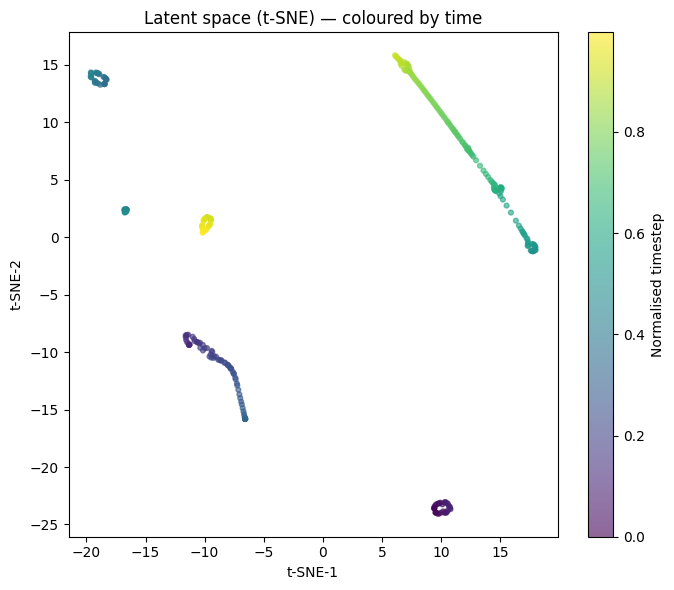
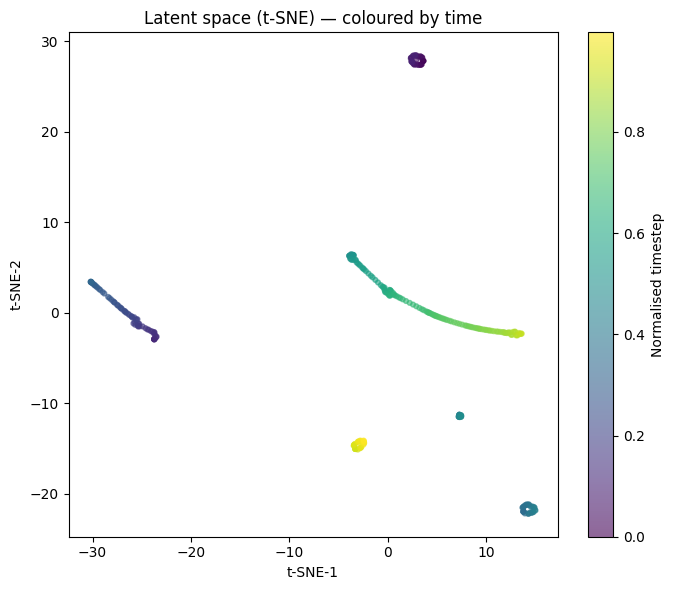

# Model Architecture

LeWM is a JEPA-based world model trained on Duckietown lane-following data. It learns latent dynamics (predict next latent state given current state + action) rather than pixel dynamics.

Paper: [LeWM — arXiv:2603.19312](https://arxiv.org/abs/2603.19312) (Maes et al., March 2026)

## Overview

```
obs (224×224×3 RGB)
      │
   [Encoder]  ViT-Tiny (patch_size=14)
      │  z ∈ ℝ^192
   [Projector] MLP(192 → 2048 → 192, BatchNorm1d)
      │
   [ARPredictor] autoregressive transformer
      │  + action_encoder(a ∈ ℝ^2) → ℝ^192
      │
   pred_proj → ẑ_{t+1} ∈ ℝ^192
```

Loss: `MSE(ẑ_{t+1}, sg(z_{t+1}))` + SIGReg (collapse prevention)

## Encoder

- ViT-Tiny: `patch_size=14`, `image_size=224`, `hidden_size=192`
- Followed by projector: `MLP(192 → 2048 → 192)` with `BatchNorm1d`
- Total ~5M params for encoder+projector

## ARPredictor

- Autoregressive transformer: `depth=6`, `heads=16`, `dim_head=64`, `mlp_dim=2048`
- Context window: `HISTORY=3` frames
- Input: `(z_t, z_{t-1}, z_{t-2})` + `(a_t, a_{t-1}, a_{t-2})` → predict `z_{t+1}`
- Sequence format during training: `SEQ_LEN=4` (3 context + 1 target)
- At inference: `ctx_emb = emb[:, :3]`, `ctx_act = act_emb[:, :3]`, `tgt_emb = emb[:, 1:]`

## Action Encoder

```
Embedder(input_dim=2, smoothed_dim=2, emb_dim=192, Conv1d kernel=1)
```

Actions are `[vel, steer]` float32 pairs (gym-duckietown action space).

## SIGReg

Signature-based regularisation to prevent representational collapse:
- `SIGReg(knots=17, num_proj=1024)`
- Penalises collapse of the latent space without requiring a separate target network (unlike BYOL/DINO)

## Key Config

| Parameter   | Value |
|-------------|-------|
| EMBED_DIM   | 192   |
| IMG_SIZE    | 224   |
| HISTORY     | 3     |
| N_PREDS     | 1     |
| SEQ_LEN     | 4     |
| LAG_FRAMES  | 4     |
| FRAMESKIP   | 1     |
| BATCH_SIZE  | 512 (Colab A100) |
| N_EPOCHS    | 50    |

## Data Format

Each transition in `duckietown_100k.h5`:
- `pixels`: (120×160×3) uint8 — raw gym-duckietown observation
- `action`: (2,) float32 — [vel, steer]
- `episode_idx`: int
- `step_idx`: int

Observations are resized to 224×224 during training. 100k transitions, 738 episodes, collected 2026-04-24 with `LaneFollowController` using `env.get_lane_pos2()`.

## VoE (Violation of Expectation) Eval

The model detects distributional surprise via prediction error. Confirmed working:
- PD controller runs normally for 30 steps → low prediction error
- Teleport injected at step 30 → prediction error spike at t=31
- This confirms the model is learning real dynamics, not trivial features

## Latent Space Visualisations (t-SNE)

t-SNE of encoder embeddings across several episodes, coloured by normalised timestep (purple = start, yellow = end).

### FRAMESKIP=1 (`image_skipframe1.png`)



- Multiple distinct clusters, each corresponding to a separate episode
- Within-cluster colour gradients show clear temporal structure — the model separates states by time within an episode
- Space is **fragmented**: different episodes land in isolated regions with no bridge between them
- This fragmentation explains the growing `z_dist` observed during MPC: the goal frame lives in one cluster and the agent starts in another, with no gradient path between them

### FRAMESKIP=3 (`image_skipframe_3.png`)



- Fewer clusters; one large cluster shows a smooth curved trajectory over time
- Also fragmented — episodes cluster separately
- The smoother within-cluster trajectory may reflect the 3× subsampling reducing high-frequency noise, but at the cost of the policy-entanglement bug (see `lessons.md`)

### Implications for MPC

The fragmented latent structure is a fundamental challenge for single-goal MPC: if `z_goal` and the agent's current `z_t` are in different clusters, the CEM planner has no reward gradient to follow across the gap. Options to address this:
- Use a **goal trajectory** (sequence of latents from a good episode) rather than a single frame, so the goal moves into the agent's current cluster
- Add a **contrastive or time-contrastive loss** during training to pull temporally adjacent states together across episodes
- Use a **lane-reward function** in latent space rather than MSE to a fixed goal frame
